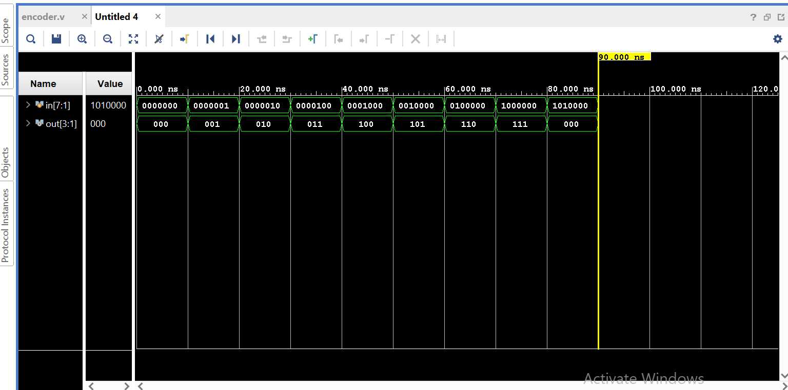

# 8:3 Encoder using Verilog HDL

## Overview
Designed and simulated an 8:3 combinational encoder in Verilog HDL. The design converts a one-hot 8-bit input into its corresponding 3-bit binary output.

## Features
- Behavioral Verilog implementation
- Combinational logic design
- Separate testbench for verification
- Simulated using Xilinx Vivado
- Functional verification using waveform analysis

## Files

- `encoder.v` – RTL design
- `encoder_tb.v` – Testbench
- `waveform.png` – Simulation waveform

## Test Cases

| Input | Output |
|-------|--------|
|00000001|001|
|00000010|010|
|00000100|011|
|00001000|100|
|00010000|100|
|00100000|101|
|01000000|110|
|10000000|111|

## Simulation Waveform

## Tools Used
- Verilog HDL
- Xilinx Vivado
