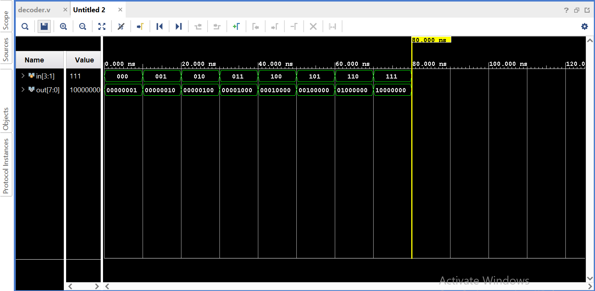

# 3-to-8 Decoder using Verilog HDL

## Overview
This project implements a combinational 3-to-8 decoder in Verilog HDL. The decoder converts a 3-bit binary input into one of eight active-high output lines. It is a fundamental digital circuit widely used in memory addressing, instruction decoding, and control unit design.

## Features
- RTL implementation in Verilog HDL
- Combinational logic design
- Synthesizable code
- Comprehensive testbench covering all input combinations
- Functional verification using Xilinx Vivado
- Simulation waveform included

## Files
- `decoder.v` – RTL implementation of the 3-to-8 decoder
- `decoder_tb.v` – Testbench for simulation
- `waveform.png` – Simulation waveform

## Truth Table

| Input | Output |
|-------|----------------|
| 000 | 00000001 |
| 001 | 00000010 |
| 010 | 00000100 |
| 011 | 00001000 |
| 100 | 00010000 |
| 101 | 00100000 |
| 110 | 01000000 |
| 111 | 10000000 |

## Simulation Result

The simulation verifies that for every 3-bit input combination, exactly one output line is asserted HIGH while all others remain LOW.

## Applications
- Memory address decoding
- Instruction decoding
- Chip select logic
- Control unit design
- Digital communication systems

## Tools Used
- Verilog HDL
- Xilinx Vivado
